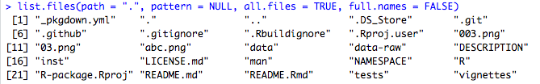

## Overview
The package I reviewed is called "covid", created and maintained by Chenjie Gong. The package is neatly formed with 10 folders, several essential files and importantly, licensed with GPL-3.

"covid" package touches on three aspects of a package's capability with its multi-dimensional usage. With the dataset obtained from Johns Hopkins University Center for Systems Science and Engineering (JHU CCSE), Chenjie combines it to `covid` package and makes it available and shareable in R. A shiny application named "COVID-19 TRACKER" made by Chenjie earlier is also built with the same dataset. "COVID-19 TRACKER" has subsequently been merged with `covid` package, so that users can now access the app through `covid` package.

## What did I think this package would do? Did it do it?
The folders and files altogether fulfill each of their purpose well. It can be seen 

Taking in the dataset and one of the categories of Covid-19 measurements("cases_new", "deaths_new" and "recovered_new"), `type_select` integrates with `selecttype` function to produce the chosen category.
`plot_theme` serves as a theme generator that wraps the plots with specified theme.
The usage for `plot_cases` is reflected in the app.R where it plots the new cases number according to users' selected country.
Having the dataset as the only input, `n_countries` counts the distinct countries involved in `coronavirus` dataset.
As the function name indicates, `launch_app` itself would directly launch the "COVID-19 TRACKER" app generated by app.R, without any input.
Bounded by the minimum and maximum dates of the date range, `selectdate` seems to allow a date to be selected.
`countryinput` acts as a collection of countries which is adopted to the dropdown list for selection and is further integrated with the table.
Consisted of several categories of Covid-19 measurements("cases_new", "deaths_new" and "recovered_new"), `count_type` sums up the total number with the given date and the specified
category in the input.